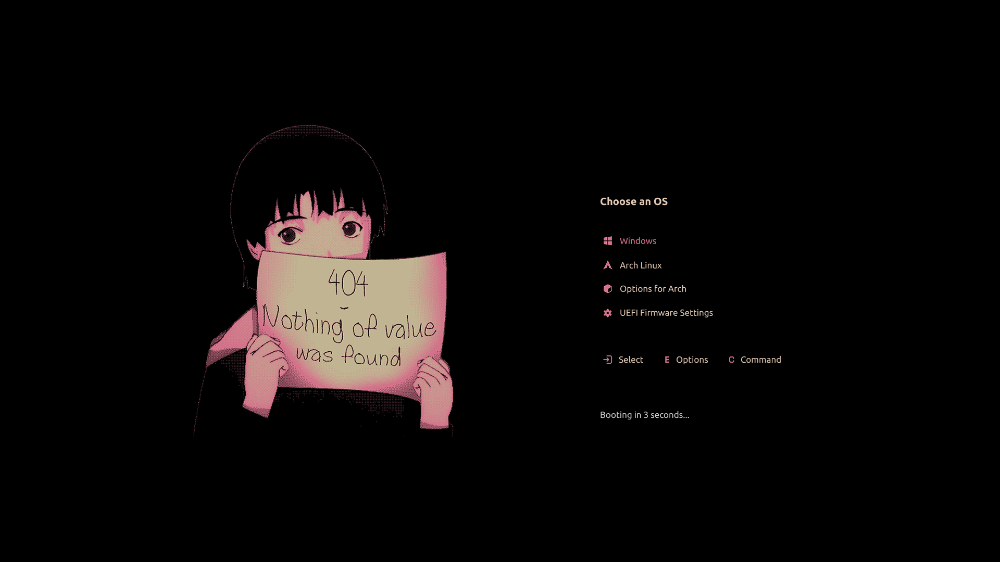

# Lain GRUB Theme

原项目：https://github.com/uiriansan/LainGrubTheme

## Installation

克隆仓库：

```bash
git clone https://github.com/apbin/LainGrubTheme.git
cd LainGrubTheme
```

给脚本执行权限：

```bash
chmod +x install.sh patch_entries.sh
```

安装主题：

```bash
./install.sh
```

应用 GRUB 菜单修改：

```bash
./patch_entries.sh
```

## Our Changes

在原版基础上主要进行了以下修改：

* 重写 `install.sh`
* 重写 `patch_entries.sh`
* 简化 Windows / Linux / Advanced Options 菜单名称
* 添加 UEFI Firmware Settings class
* 添加 Snapper Snapshots class
* 简化 Btrfs / Snapper Snapshot 菜单
* 禁用 EFI BootNext 菜单项
* 修改前自动备份 `/etc/grub.d/` 
* 支持重复执行脚本

## Environment

本项目主要在以下环境中测试：

* **OS:** CachyOS
* **Kernel:** CachyOS Linux
* **Architecture:** x86_64
* **Desktop:** niri / Wayland
* **Bootloader:** GRUB 2.16
* **Filesystem:** Btrfs
* **Snapshot:** Snapper + grub-btrfs
* **Display:** 3072×1920
* **Theme Resolution:** 1920×1080

> [!NOTE]
> 本项目虽然主要在 CachyOS 上测试，但主题本身不依赖 CachyOS。
> `patch_entries.sh` 中部分功能依赖 GRUB、os-prober、grub-btrfs 等组件的配置结构。

## Resolution

本主题目前按照 **1920×1080** 设计。

默认使用：

```bash
GRUB_GFXMODE=1920x1080
```

即使 Linux 桌面使用更高分辨率，也不影响 GRUB 使用 1920×1080。

## Scripts

### `install.sh`

负责：

* 安装 Lain Theme
* 设置 `GRUB_THEME`
* 设置 `GRUB_GFXMODE=1920x1080`
* 设置 `GRUB_DEFAULT=saved`
* 设置 `GRUB_SAVEDEFAULT=true`

### `patch_entries.sh`

负责：

* GRUB 备份
* Linux Entry  
* Windows Entry
* EFI BootNext 
* Advanced Options
* UEFI Firmware Settings
* Btrfs / Snapper Snapshots

## Uninstall

删除主题：

```bash
sudo rm -rf /boot/grub/themes/lain
```

然后编辑：

```bash
sudoedit /etc/default/grub
```

删除：

```bash
GRUB_THEME="/boot/grub/themes/lain/theme.txt"
```

最后重新生成：

```bash
sudo grub-mkconfig -o /boot/grub/grub.cfg
```

如果需要恢复 `patch_entries.sh` 修改的 GRUB 脚本，可使用：

```text
/etc/grub.d/backup-grub-custom/
```

中的备份文件恢复。

## Credits

* Original theme: [uiriansan/LainGrubTheme](https://github.com/uiriansan/LainGrubTheme)
* Code reference: [AdisonCavani/distro-grub-themes](https://github.com/AdisonCavani/distro-grub-themes)
* Lain banner: https://fauux.neocities.org/

